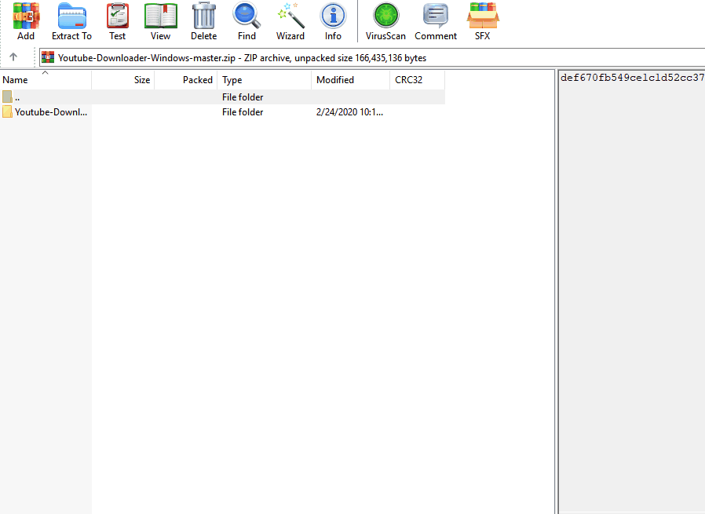
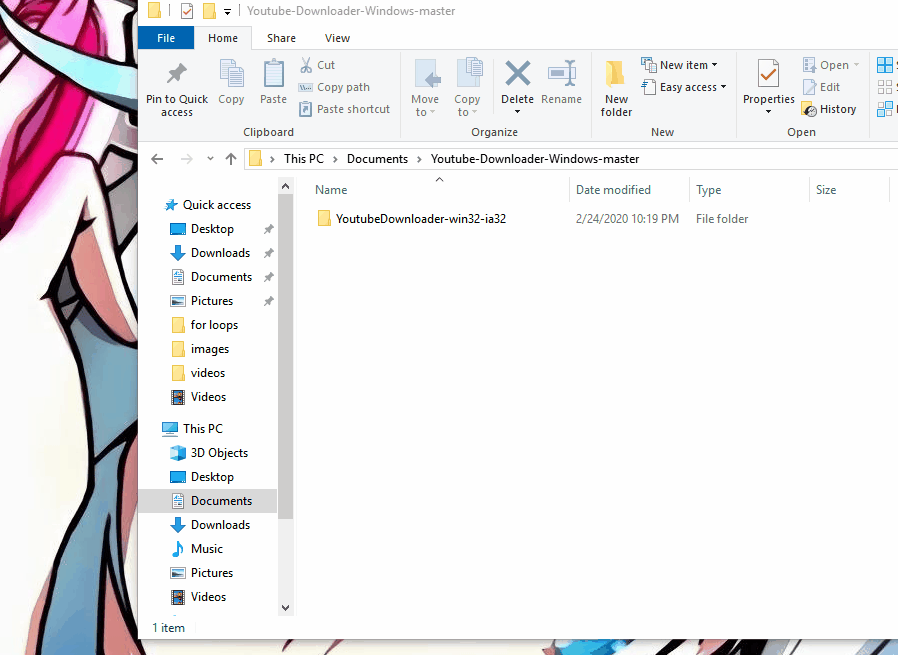

# Youtube Downloader
An Electron desktop application to download Youtube videos

## Disclaimer

Using third-party apps to download videos is against YouTube's terms of service, which say you can only stream videos directly from its servers. Downloading videos is also a potential copyright infringement unless you own the video yourself, have permission from the copyright holder, or it's in the public domain.

This application was created to demonstrate the author's skills and only for that reason. Keep in mind the only videos that you're allowed to download is your own. By using this application you agree to these terms.

## Technologies Used

- Electron
- Youtube-DL
- Electron-Packager
- Node JS
- Vanilla JavaScript

## Windows Download Instructions

1. [Download the zip file](https://github.com/uzair-ashraf/Youtube-Downloader-Windows/archive/master.zip)

1. Extract the zip file to any directory in your local file system

    <p align='center'>
      
    </p>

1. Navigate to the directory, create a shortcut, and bring to Desktop

    <p align='center'>
      
    </p>

1. Double click and enjoy!

    <p align='center'>
      
    </p>

## Mac Download Instructions

  _Build Coming Soon_

## Linux Download Instructions

  _Build Coming Soon_

## Known Bugs

- Videos download at low quality, this will be fixed in next build

## Features

- User can validate video link
- User can select directory
- User can view download progress
- User can download video

## Future Features

- User can select video quality
- User can download audio only
- User can run application on Mac
- User can run application on Linux

## Preview

  <p align='center'>
    
  </p>


## Development

#### System Requirements

- NPM 6 or higher
- Node 10 or higher

#### Getting Started

1. Clone the repository.

    ```shell
    git clone https://github.com/uzair-ashraf/youtube-downloader.git
    cd youtube-downloader
    ```

1. Install all dependencies with NPM.

    ```shell
    npm install
    ```

1. Start the project.

    ```shell
    npm start
    ```

#### Bundle a Windows Build

1. Start electron-packager

    ```shell
    npm run package-win
    ```

1. Change directory into the build

    ```shell
    cd release-builds
    ```

1. Open folder in explorer

    ```shell
    start .
    ```

1. Double click application to open!
